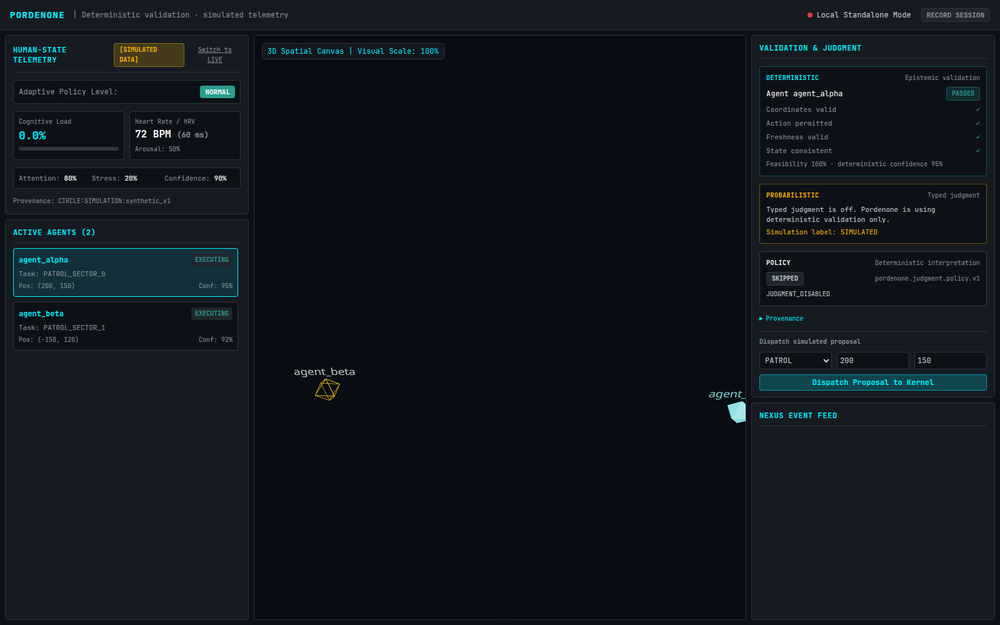
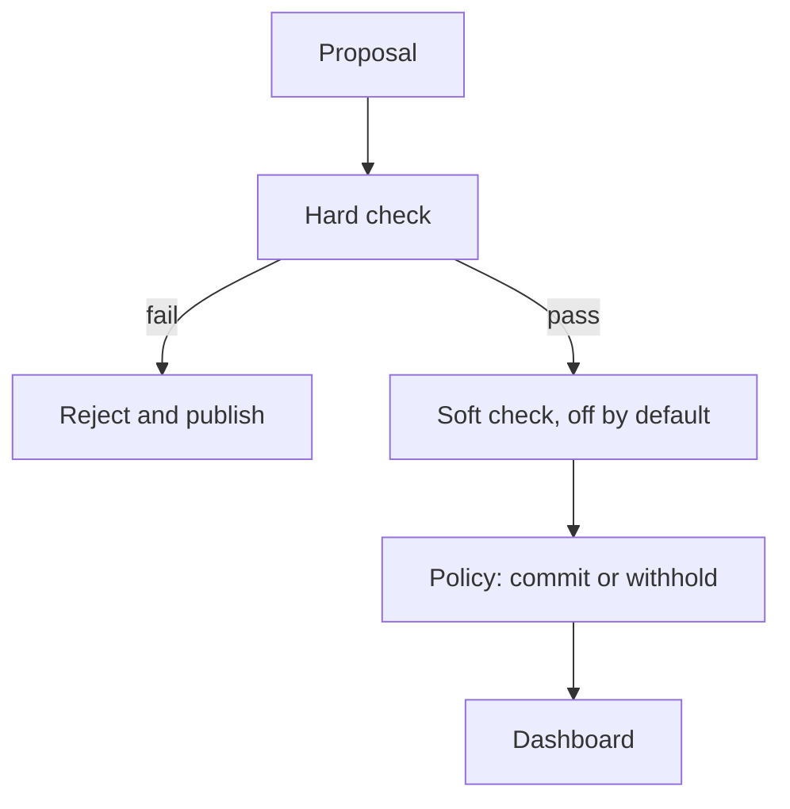

# Pordenone

A proposal has to pass a hard rule-check before an optional model check, and the session can be recorded and replayed.



The picture is that dashboard (`apps/c2-dashboard`) with no backend connected. Heart rate and cognitive load are labeled `SIMULATED`. Two agents sit on the 3D canvas. The proposal on the right passed the hard check; the model check stayed off. Nothing in this repository moves physical hardware.

[](https://www.rust-lang.org/)
[](https://pnpm.io/)
[](https://www.python.org/)
[](LICENSE)

## What this is for

Stored state should not change because a model felt confident. Pordenone keeps three steps in that order:

1. **Hard check.** A deterministic validator rejects coordinates outside bounds, stale observations, and actions that are not on the allow-list. A failure stops the proposal. No model is called.
2. **Soft check, off by default.** If the hard check passes and `JUDGMENT_ENABLED=true`, a model answers a fixed set of questions. It cannot override a failed hard check, and it cannot write state.
3. **Replay.** Record a session and play it back with no network calls. See [`docs/replay.md`](docs/replay.md).

The code is [MIT licensed](LICENSE). Citation metadata is in [`CITATION.cff`](CITATION.cff).

## Names in the code

A few labels in the source are shorter than their meaning. They are names in this repository, not packages you have to install:

| Name in the code | What it is here |
| :--- | :--- |
| **CIRCLE** | The simulated human-state stream: heart rate, heart-rate variability, cognitive load, and stress. Samples are marked `SIMULATED` unless that process is started in `LIVE` mode. |
| **NEXUS** | The in-memory event bus. It fans events out to the dashboard. |
| **DRR** | A small local formula that maps cognitive load onto `NORMAL`, `ELEVATED`, `HIGH`, or `CRITICAL`. |

## How a proposal moves

```
proposal
   │
   ▼
hard check (always on)
   │
   ├── fail → reject, publish, stop
   │
   └── pass → soft check (optional; off unless JUDGMENT_ENABLED=true)
                 │
                 ▼
              policy commits or withholds
                 │
                 ▼
              event bus (NEXUS) → dashboard
```



---

## Monorepo Directory Structure

```
pordenone/
├── apps/
│   └── c2-dashboard/          # Next.js 14 research dashboard: React Three Fiber spatial canvas and status panels
├── crates/                    # Rust core kernel workspace crates
│   ├── epistemic-validator/   # Deterministic epistemic & physical constraint validation
│   ├── event-bus/             # Asynchronous fan-out event bus with correlation tracking
│   ├── kernel-core/           # Kernel state machine (Observe -> Propose -> Validate -> Judge -> Commit)
│   ├── spatial-state/         # 3D Spatial state index & terrain coordinate synchronization
│   ├── telemetry-bridge/      # WebSocket bridge streaming telemetry & kernel events
│   └── typed-judgment/        # Remote/mock/replay typed judgment provider & disposition policy
├── services/                  # Python simulation & telemetry services
│   ├── biometric-pipeline/    # Simulated human-state stream (named CIRCLE in source)
│   ├── sim-engine/            # Swarm step and load-to-level formula (named DRR in source)
│   └── judgment/              # Python replay & judgment recorded session utilities
├── packages/
│   └── shared-types/          # Shared TypeScript interfaces & Protobuf type bindings
├── proto/                     # Protocol Buffer definitions
│   ├── agent.proto            # Agent lifecycle & proposal messages
│   ├── events.proto           # Canonical event envelopes
│   ├── judgment.proto         # Typed judgment questions, scores & envelopes
│   ├── spatial.proto          # Spatial position & terrain state
│   └── telemetry.proto        # Operator biometric telemetry & adaptive states
├── scripts/
│   ├── generate-proto.sh      # Python & gRPC protobuf generation script
│   ├── record-session         # CLI tool to record telemetry & judgment sessions
│   └── replay-session         # CLI tool to verify recorded sessions deterministically
├── docs/                      # Technical architecture & integration documentation
└── docker/                    # Dockerfiles for containerized microservices
```

---

## Conceptual Map

You can skip this table if you only want to run the dashboard. It maps nine other repositories onto code that lives here. None of them are git submodules, path dependencies, or imported packages. The "Reimplemented here" column is local code, not an upstream import. TypeSafe is the exception: an optional remote model, disabled unless `JUDGMENT_ENABLED=true`. The same notes are in [`docs/integration-matrix.md`](docs/integration-matrix.md).

| Conceptual source | Idea | Reimplemented here | Local interface |
| :--- | :--- | :--- | :--- |
| **`james_library`** | Agent proposal loop and epistemic checks | `crates/kernel-core` (`KernelEngine`) and `crates/epistemic-validator` (`EpistemicValidator`) | `ActionProposal`, `ValidationResult` |
| **`dynamic-resonance-rooting`** | Adaptive state from load and stability | `services/sim-engine/drr_adapter.py` (`DynamicResonanceRootingAdapter`) | `AdaptiveState` |
| **`ions-x-deep-emergence-lab`** | Multi-agent spatial simulation | `services/sim-engine/emergence_sim.py` (`SwarmEmergenceSimulator`) | `sim_engine.step()` |
| **`waveform-shift-quantum`** | Bounds a proposal must satisfy | Coordinate, freshness, priority, and action checks inside `EpistemicValidator::validate` | `ValidationResult` |
| **`circle`** | Human-state telemetry | `services/biometric-pipeline/biometric_generator.py` (`BiometricPipeline`). Samples are `SIMULATED` unless the process is started in `LIVE` mode | `OperatorStateTelemetry` |
| **`embedded-ai-validation-platform`** | Fault and sensor checks before commit | No hardware adapter is included. Proposals are accepted or rejected by `EpistemicValidator` and published on `crates/event-bus` | `CanonicalEventEnvelope` |
| **`lop-nur-twin`** | 3D spatial scene | `apps/c2-dashboard/src/components/SpatialCanvas.tsx`, a local procedural mesh | `SpatialCanvas` props |
| **`orpheus-resonance-protocol`** | Status display for human state and validation | `OperatorPanel.tsx` and `ValidationInspector.tsx`. These panels are written in this repository | `OperatorStateTelemetry`, `AdaptiveState`, `JudgmentEnvelope` |
| **`cognisync-terrain-weaver`** | Spatial index | `crates/spatial-state` (`SpatialIndex`) | `SpatialEntity` |
| **TypeSafe Jev** | Optional remote typed judgment | `crates/typed-judgment` (`TypeSafeJudgmentProvider`), off by default | `JudgmentEnvelope`, [`typed-judgment.md`](docs/typed-judgment.md) |

---

## Quickstart

### Prerequisites
- **Rust** 1.80+ (`cargo`)
- **Node.js** 20+ & **pnpm** (`pnpm@10+`)
- **Python** 3.11+ (`pip`)
- **Protobuf Compiler** (`protoc`)

### Installation

```bash
# Clone repository
git clone https://github.com/topherchris420/resonate-ai-mesh.git
cd resonate-ai-mesh

# Install Node dependencies across workspace
pnpm install

# Install Python requirements
pip install -r services/biometric-pipeline/requirements.txt -r services/sim-engine/requirements.txt

# Generate Protobuf bindings
pnpm proto:generate
```

---

## Developer Workflows & Commands

### Build & Compilation
```bash
# Build TypeScript shared types and dashboard
pnpm build

# Build Rust workspace crates
cargo build --workspace
```

### Testing
```bash
# Run full workspace test suite (JS/TS, Python, Rust)
pnpm test

# Run Rust tests only
cargo test --workspace

# Run Python service tests only
PYTHONPATH=services/biometric-pipeline:services/sim-engine pytest services/ tests/
```

### Code Quality & Verification
```bash
# Run ESLint across packages
pnpm lint

# Run TypeScript typechecks
pnpm typecheck

# Run Cargo clippy linter on Rust crates
cargo clippy --workspace --all-targets -- -D warnings
```

### Session Recording & Replay Workflow
Pordenone supports deterministic session recording and replay for debugging and audit verification:

```bash
# Record a 5-second execution session
python3 scripts/record-session my_session.json

# Replay and verify recorded session deterministically
python3 scripts/replay-session my_session.json
```

---

## Configuration & Environment Variables

### Kernel & Typed Judgment
Remote judgment is **disabled by default**. CI runs cleanly without remote network credentials.

| Variable | Default | Description |
| :--- | :--- | :--- |
| `JUDGMENT_ENABLED` | `false` | Master toggle for remote typed judgment evaluation |
| `JUDGMENT_PROVIDER` | `disabled` | Provider implementation (`disabled`, `typesafe`, `mock`, `replay`) |
| `JUDGMENT_MODEL` | `jev-latest` | Model identifier passed to remote judgment provider |
| `TYPESAFE_API_KEY` | *(unset)* | API key required when `JUDGMENT_PROVIDER=typesafe` |
| `JUDGMENT_TIMEOUT_MS` | `10000` | Timeout in milliseconds for remote judgment network calls |
| `JUDGMENT_MINIMUM_CONFIDENCE` | `0.70` | Confidence gate threshold required for commit approval |
| `JUDGMENT_POLICY_VERSION` | `pordenone.judgment.policy.v1` | Version identifier for judgment policy rules |

### Services & Networking
| Variable | Default | Description |
| :--- | :--- | :--- |
| `BIND_ADDR` | `0.0.0.0:50051` | Kernel gRPC service bind address |
| `WS_BIND_ADDR` | `0.0.0.0:8080` | Telemetry bridge WebSocket bind address |
| `KERNEL_ADDR` | `http://kernel:50051` | Telemetry bridge connection target for kernel |
| `TELEMETRY_BRIDGE_WS` | `ws://telemetry-bridge:8080/ingest` | WebSocket ingestion URL for Python services |
| `NEXT_PUBLIC_WS_URL` | `ws://localhost:8080/ws` | Frontend WebSocket endpoint for real-time telemetry feed |
| `NEXT_PUBLIC_SIM_ENGINE_URL` | `http://localhost:8000` | Frontend endpoint for simulation engine HTTP control |

---

## Docker Compose Microservices Topology

Launch all 5 containerized microservices with full networking using Docker Compose:

```bash
docker compose up --build
```

| Service | Dockerfile | Exposed Port | Role & Responsibility |
| :--- | :--- | :--- | :--- |
| **`kernel`** | `docker/Dockerfile.kernel` | `50051` (gRPC) | Rust kernel engine, epistemic validator & typed judgment policy |
| **`telemetry-bridge`** | `docker/Dockerfile.telemetry-bridge` | `8080` (WebSocket) | Event normalization, fan-out broadcast & client WS streaming |
| **`biometric-pipeline`** | `docker/Dockerfile.biometric-pipeline` | Internal | Simulated human-state stream (CIRCLE in the source) |
| **`sim-engine`** | `docker/Dockerfile.sim-engine` | `8000` (HTTP) | Swarm step and the load-to-level formula (DRR in the source) |
| **`c2-dashboard`** | `docker/Dockerfile.c2-dashboard` | `3000` (HTTP) | Next.js 3D spatial canvas and research dashboard |

---

## Security & Safety Boundaries

1. **Simulation Default**: Defaults to **SIMULATION** mode and local execution.
2. **Deterministic Gate Priority**: Unvalidated agent proposals **CANNOT** mutate authoritative state. Deterministic epistemic checks run prior to judgment.
3. **Fail-Closed Judgment Boundary**: Remote typed judgment is disabled by default. A remote provider cannot override a failed deterministic validation or mutate authoritative state directly.
4. **Biosignal Isolation & Privacy**: Simulated physiological telemetry is explicitly labeled as `SIMULATED`. Raw biosignals are never included in remote judgment state payloads or logged externally.
5. **Replay Integrity**: Recorded replay sessions execute with zero external network side-effects.
6. **No Irreversible Actuation**: No real-world physical actuation or autonomous weapon engagement is implemented.

---

## License and Citation

This project is released under the [MIT License](LICENSE). Copyright (c) 2026 Vers3Dynamics.

If you use this software, cite it with the metadata in [`CITATION.cff`](CITATION.cff).

---

## Documentation Directory

For detailed specifications, refer to the guides in [`docs/`](docs/):

- [`docs/architecture.md`](docs/architecture.md) – Detailed architecture breakdown and component interactions
- [`docs/development.md`](docs/development.md) – Developer setup, testing, and CI configuration
- [`docs/event-model.md`](docs/event-model.md) – Canonical NEXUS event structure and schema specifications
- [`docs/integration-matrix.md`](docs/integration-matrix.md) – Conceptual map of nine source ideas and the local code that reimplements them
- [`docs/protocol.md`](docs/protocol.md) – Communication protocols (gRPC, WebSocket, Protobuf)
- [`docs/replay.md`](docs/replay.md) – Replay engine and session recording mechanics
- [`docs/typed-judgment.md`](docs/typed-judgment.md) – Typed judgment fabric, atomic question set, and policy engine
