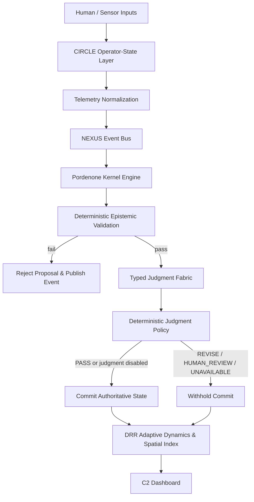

# Pordenone: Unified Cognitive Cyber-Physical Command-and-Control Research Platform

[](https://www.rust-lang.org/)
[](https://pnpm.io/)
[](https://www.python.org/)
[](#security--safety-boundaries)

**Pordenone** is a research monorepo integrating capabilities across 9 domain-specific repositories into a unified cognitive cyber-physical command-and-control (C2) architecture.

The platform provides deterministic epistemic validation of agent proposal loops, closed-loop operator state telemetry, real-time spatial digital twin rendering, and an opt-in typed judgment fabric backed by deterministic disposition policies.

---

## Conceptual Pipeline & Architecture

The execution pipeline enforces strict ordering: no unvalidated agent proposal can mutate authoritative state. Deterministic epistemic checks run first; optional remote typed judgment is evaluated second; deterministic disposition policy makes the commit/withhold decision.

```
Human / Sensor Inputs
        │
        ▼
CIRCLE Operator-State Layer (Biometric & Cognitive Telemetry)
        │
        ▼
Telemetry Normalization
        │
        ▼
NEXUS Event Bus (Async In-Memory Fan-out & Correlation)
        │
        ▼
Pordenone Kernel Engine (Observe ➔ Propose ➔ Validate ➔ Judge ➔ Policy ➔ Commit/Withhold)
        │
  ┌─────┴────────────────────────────────┐
  ▼                                      ▼
[Deterministic Epistemic Validation]  [Typed Judgment Fabric] (Opt-in; off by default)
  │ (Must Pass)                          │ (TypeSafe / Jev / Mock)
  └─────┬────────────────────────────────┘
        │
        ▼
Deterministic Judgment Policy (Evaluates Support vs Contradiction & Gate Thresholds)
        │
   ┌────┴────────────────────────┐
   ▼                             ▼
Commit Authoritative State     Withhold Commit & Log Rejection
   │                             │
   └──────────────┬──────────────┘
                  │
                  ▼
DRR Adaptive Dynamics ➔ Spatial State Sync ➔ C2 Dashboard (3D R3F Canvas & Tactical HUD)
```

### Flowchart (Mermaid)



---

## Monorepo Directory Structure

```
pordenone/
├── apps/
│   └── c2-dashboard/          # Next.js 14 C2 Dashboard with React Three Fiber 3D spatial canvas & HUD
├── crates/                    # Rust core kernel workspace crates
│   ├── epistemic-validator/   # Deterministic epistemic & physical constraint validation
│   ├── event-bus/             # Asynchronous fan-out event bus with correlation tracking
│   ├── kernel-core/           # Kernel state machine (Observe -> Propose -> Validate -> Judge -> Commit)
│   ├── spatial-state/         # 3D Spatial state index & terrain coordinate synchronization
│   ├── telemetry-bridge/      # WebSocket bridge streaming telemetry & kernel events
│   └── typed-judgment/        # Remote/mock/replay typed judgment provider & disposition policy
├── services/                  # Python simulation & telemetry services
│   ├── biometric-pipeline/    # CIRCLE operator state generator & telemetry stream producer
│   ├── sim-engine/            # Ions Lab swarm emergence simulator & DRR state calculator
│   └── judgment/              # Python replay & judgment recorded session utilities
├── packages/
│   └── shared-types/          # Shared TypeScript interfaces & Protobuf type bindings
├── proto/                     # Protocol Buffer definitions
│   ├── agent.proto            # Agent lifecycle & proposal messages
│   ├── events.proto           # Canonical event envelopes
│   ├── judgment.proto         # Typed judgment questions, scores & envelopes
│   ├── spatial.proto          # Spatial position & terrain state
│   └── telemetry.proto        # Operator biometric telemetry & adaptive states
├── scripts/
│   ├── generate-proto.sh      # Python & gRPC protobuf generation script
│   ├── record-session         # CLI tool to record telemetry & judgment sessions
│   └── replay-session         # CLI tool to verify recorded sessions deterministically
├── docs/                      # Technical architecture & integration documentation
└── docker/                    # Dockerfiles for containerized microservices
```

---

## Repository Map & Integration Matrix

The platform integrates capabilities from 9 domain repositories behind clean, versioned interfaces. For full mapping details, see [`docs/integration-matrix.md`](docs/integration-matrix.md).

| Domain Repository | Integrated Role | Imported Components | Required Adapter | Canonical Interface |
| :--- | :--- | :--- | :--- | :--- |
| **`james_library`** | Agent / Epistemic Kernel | Multi-agent execution loop, state machine | Rust trait adapter | `pordenone::kernel::AgentLifecycle`, `pordenone::validator::EpistemicValidator` |
| **`dynamic-resonance-rooting`** | Adaptive Dynamics | Nonlinear adaptation & resonance metrics | Python `DRRAdapter` | `AdaptiveState`, `proto.telemetry.AdaptiveState` |
| **`ions-x-deep-emergence-lab`** | Emergent Multi-Agent Sim | Vector-field evolution, agent swarm state | Python gRPC/REST adapter | `proto.spatial.SpatialState`, `sim_engine.step()` |
| **`waveform-shift-quantum`** | Physical / Falsifiable Sim | Physical parameter bounds & validation | Rust physical checker | `pordenone::validator::PhysicalConstraintChecker` |
| **`circle`** | Human-State Sensing | Biometric telemetry & HRV/arousal models | Python biometric pipeline | `proto.telemetry.OperatorStateTelemetry` |
| **`embedded-ai-validation-platform`** | Embedded Validation | HIL fault injection & sensor fusion | HIL telemetry adapter | `proto.events.CanonicalEventEnvelope` |
| **`lop-nur-twin`** | 3D GEOINT / Digital Twin | Procedural desert terrain & shaders | React Three Fiber canvas | `packages/shared-types/spatial`, `SpatialCanvas.tsx` |
| **`orpheus-resonance-protocol`** | Tactical HUD / Telemetry | Real-time HUD UI components & overlays | Next.js HUD components | `OperatorPanel`, `ValidationPanel` |
| **`cognisync-terrain-weaver`** | Spatial Synchronization | Coordinate sync & scenario studio state | Rust spatial index | `pordenone::spatial::SpatialIndex` |
| **TypeSafe Jev** | Remote Typed Judgment | System One Choice, Score & Noul evaluation | `TypeSafeJudgmentProvider` | `docs/typed-judgment.md` |

---

## Quickstart

### Prerequisites
- **Rust** 1.80+ (`cargo`)
- **Node.js** 20+ & **pnpm** (`pnpm@10+`)
- **Python** 3.11+ (`pip`)
- **Protobuf Compiler** (`protoc`)

### Installation

```bash
# Clone repository
git clone https://github.com/pordenone/pordenone.git
cd pordenone

# Install Node dependencies across workspace
pnpm install

# Install Python requirements
pip install -r services/biometric-pipeline/requirements.txt -r services/sim-engine/requirements.txt

# Generate Protobuf bindings
pnpm proto:generate
```

---

## Developer Workflows & Commands

### Build & Compilation
```bash
# Build TypeScript shared types and dashboard
pnpm build

# Build Rust workspace crates
cargo build --workspace
```

### Testing
```bash
# Run full workspace test suite (JS/TS, Python, Rust)
pnpm test

# Run Rust tests only
cargo test --workspace

# Run Python service tests only
PYTHONPATH=services/biometric-pipeline:services/sim-engine pytest services/ tests/
```

### Code Quality & Verification
```bash
# Run ESLint across packages
pnpm lint

# Run TypeScript typechecks
pnpm typecheck

# Run Cargo clippy linter on Rust crates
cargo clippy --workspace --all-targets -- -D warnings
```

### Session Recording & Replay Workflow
Pordenone supports deterministic session recording and replay for debugging and audit verification:

```bash
# Record a 5-second execution session
python3 scripts/record-session my_session.json

# Replay and verify recorded session deterministically
python3 scripts/replay-session my_session.json
```

---

## Configuration & Environment Variables

### Kernel & Typed Judgment
Remote judgment is **disabled by default**. CI runs cleanly without remote network credentials.

| Variable | Default | Description |
| :--- | :--- | :--- |
| `JUDGMENT_ENABLED` | `false` | Master toggle for remote typed judgment evaluation |
| `JUDGMENT_PROVIDER` | `disabled` | Provider implementation (`disabled`, `typesafe`, `mock`, `replay`) |
| `JUDGMENT_MODEL` | `jev-latest` | Model identifier passed to remote judgment provider |
| `TYPESAFE_API_KEY` | *(unset)* | API key required when `JUDGMENT_PROVIDER=typesafe` |
| `JUDGMENT_TIMEOUT_MS` | `10000` | Timeout in milliseconds for remote judgment network calls |
| `JUDGMENT_MINIMUM_CONFIDENCE` | `0.70` | Confidence gate threshold required for commit approval |
| `JUDGMENT_POLICY_VERSION` | `pordenone.judgment.policy.v1` | Version identifier for judgment policy rules |

### Services & Networking
| Variable | Default | Description |
| :--- | :--- | :--- |
| `BIND_ADDR` | `0.0.0.0:50051` | Kernel gRPC service bind address |
| `WS_BIND_ADDR` | `0.0.0.0:8080` | Telemetry bridge WebSocket bind address |
| `KERNEL_ADDR` | `http://kernel:50051` | Telemetry bridge connection target for kernel |
| `TELEMETRY_BRIDGE_WS` | `ws://telemetry-bridge:8080/ingest` | WebSocket ingestion URL for Python services |
| `NEXT_PUBLIC_WS_URL` | `ws://localhost:8080/ws` | Frontend WebSocket endpoint for real-time telemetry feed |
| `NEXT_PUBLIC_SIM_ENGINE_URL` | `http://localhost:8000` | Frontend endpoint for simulation engine HTTP control |

---

## Docker Compose Microservices Topology

Launch all 5 containerized microservices with full networking using Docker Compose:

```bash
docker compose up --build
```

| Service | Dockerfile | Exposed Port | Role & Responsibility |
| :--- | :--- | :--- | :--- |
| **`kernel`** | `docker/Dockerfile.kernel` | `50051` (gRPC) | Rust kernel engine, epistemic validator & typed judgment policy |
| **`telemetry-bridge`** | `docker/Dockerfile.telemetry-bridge` | `8080` (WebSocket) | Event normalization, fan-out broadcast & client WS streaming |
| **`biometric-pipeline`** | `docker/Dockerfile.biometric-pipeline` | Internal | CIRCLE operator biometric telemetry stream generator |
| **`sim-engine`** | `docker/Dockerfile.sim-engine` | `8000` (HTTP) | Swarm emergence simulation & DRR state computation service |
| **`c2-dashboard`** | `docker/Dockerfile.c2-dashboard` | `3000` (HTTP) | Next.js 3D spatial canvas & operator command-and-control HUD |

---

## Security & Safety Boundaries

1. **Simulation Default**: Defaults to **SIMULATION** mode and local execution.
2. **Deterministic Gate Priority**: Unvalidated agent proposals **CANNOT** mutate authoritative state. Deterministic epistemic checks run prior to judgment.
3. **Fail-Closed Judgment Boundary**: Remote typed judgment is disabled by default. A remote provider cannot override a failed deterministic validation or mutate authoritative state directly.
4. **Biosignal Isolation & Privacy**: Simulated physiological telemetry is explicitly labeled as `SIMULATED`. Raw biosignals are never included in remote judgment state payloads or logged externally.
5. **Replay Integrity**: Recorded replay sessions execute with zero external network side-effects.
6. **No Irreversible Actuation**: No real-world physical actuation or autonomous weapon engagement is implemented.

---

## Documentation Directory

For detailed specifications, refer to the guides in [`docs/`](docs/):

- [`docs/architecture.md`](docs/architecture.md) – Detailed architecture breakdown and component interactions
- [`docs/development.md`](docs/development.md) – Developer setup, testing, and CI configuration
- [`docs/event-model.md`](docs/event-model.md) – Canonical NEXUS event structure and schema specifications
- [`docs/integration-matrix.md`](docs/integration-matrix.md) – Deep dive into the 9 domain repository adapters
- [`docs/protocol.md`](docs/protocol.md) – Communication protocols (gRPC, WebSocket, Protobuf)
- [`docs/replay.md`](docs/replay.md) – Replay engine and session recording mechanics
- [`docs/typed-judgment.md`](docs/typed-judgment.md) – Typed judgment fabric, atomic question set, and policy engine
