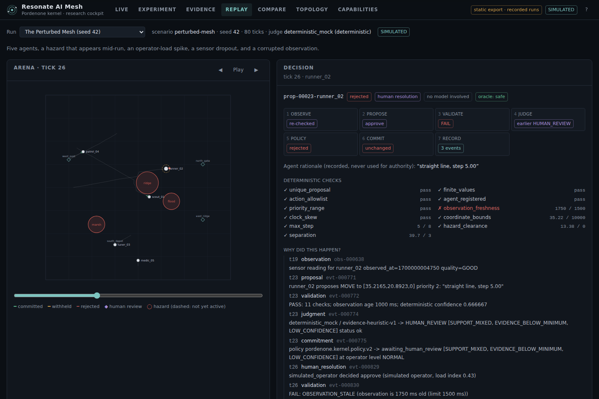
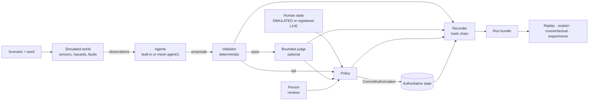

# Resonate AI Mesh

Resonate AI Mesh is an executable research instrument for multi-agent decisions. Agents observe a simulated world and propose actions. The **Pordenone kernel** decides what may happen: deterministic validation first, then optional bounded judgment, then a versioned policy, and only then a commit. Every step is recorded in a hash-chained event log, so any run can be verified, replayed exactly without network access, explained decision by decision, and branched into counterfactuals. Experiments run those runs at scale with paired statistics.

Nothing here controls physical hardware. Human-state data is simulated unless a registered live source is connected, and no live source ships with the repository.



The cockpit above is replaying the canonical run. Judgment routed `prop-00023-runner_02` to a person, and the simulated operator approved it. Re-validation then rejected it, because its observation had grown older than the 1500 ms limit while it waited. Human approval does not override a deterministic check either.

## One command

```bash
make demo        # or: cargo run --release -p mesh-lab --bin mesh -- demo
```

No API keys and no network. In about a second this:

1. Records the Perturbed Mesh scenario: five agents, a hazard that appears mid-run, an operator-load spike, a sensor dropout, and a corrupted observation.
2. Narrates it from the recorded events, covering a deterministic rejection, a judged commit, a human review, and an injected fault.
3. Walks the causal chain of one decision.
4. Replays the run and verifies all 1424 events.
5. Re-runs it with judgment disabled and reports where the timelines diverge.

The cockpit runs with `make cockpit`, which serves `mesh serve` and Next.js together. A static export of real recorded runs needs no backend (`pnpm --filter c2-dashboard dev`).

## The execution law

```
OBSERVE → PROPOSE → DETERMINISTIC VALIDATION → OPTIONAL BOUNDED JUDGMENT → POLICY → COMMIT / WITHHOLD → OBSERVE RESULT → RECORD + REPLAY
```

These hold by construction and are checked on every recorded run (see [`docs/architecture.md`](docs/architecture.md)):

- **No commit without a passing validation.** `AuthoritativeState::apply` needs a `CommitAuthorization`. Only `policy.rs` can create one, and only from a `ValidatedProposal`, which only the validator can create.
- **Judgment cannot override a failed check.** Judgment is never consulted after a failed validation, and a human approval is re-validated before it commits.
- **No remote model can mutate state.** A judge returns an envelope and has no handle to state, the bus, the filesystem, or actuators.
- **Replay makes no external calls.** Networked judges and external agents are replaced by their recordings, and replay reports `network_calls: 0`.
- **Data is labeled.** Every event carries `SIMULATED`, `LIVE`, or `REPLAY`. Unlabeled data defaults to `SIMULATED`.

## A reproducible experiment

```bash
mesh experiment run experiments/judgment-ablation/manifest.yaml
```

The manifest states a question, a hypothesis, and a pre-registered prediction. The run executes every condition at the same seeds (common random numbers) and writes `summary.json`, `runs.csv`, and `report.md`. The report gives means, medians, variances, t and bootstrap 95% intervals on paired differences, effect sizes, and a verdict on the prediction. Current results (SIMULATED, deterministic mock judges, not a language model):

| Experiment | Finding (95% CI on the paired difference) |
| --- | --- |
| judgment-ablation | An evidence-based judge removes commits made on degraded evidence: −2.79 per run [−2.94, −2.64], 100 pairs, 0 unsafe commits in every condition. Replaying its recorded judgments reproduces the effect exactly. It does **not** change task success: difference 0. |
| validator-stress | Removing only the hazard-clearance check lets 9.12 unsafe proposals per run commit [8.90, 9.34]. The check is causal. |
| fault-injection | Under ten injected faults, every authority invariant held in all 440 runs. A lost human-state signal now fails closed (−3.9 commits). The earlier hold-last behavior silently disabled gating (+12.1). |
| human-state-adaptation | Operator-load gating withholds 31.9 background commits per run [−32.49, −31.35]. |
| multi-agent-coordination | A minimum separation of 4 instead of 2 lowers task success by 0.21 [−0.28, −0.15]. |
| resonance-routing | Consulting judgment only for unstable agents cuts judgment calls by 182 per run, **but** loses its protection (+2.55 degraded commits). The claim that it keeps protection is recorded as contradicted. |

Ten claims in [`claims/`](claims/) are checked against this evidence with `mesh claims check`. The checker never upgrades a claim: a person sets the status, and the tool reports whether the evidence agrees. See [`docs/experiments.md`](docs/experiments.md) and [`docs/research-methodology.md`](docs/research-methodology.md).

## Architecture


```mermaid
graph LR
    S[Scenario + seed] --> W[Simulated world<br/>sensors, hazards, faults]
    W -->|observations| A[Agents<br/>built-in or mesh-agent/1]
    H[Human state<br/>SIMULATED or registered LIVE] --> P
    A -->|proposals| V[Validator<br/>deterministic]
    V -->|pass| J[Bounded judge<br/>optional]
    V -->|fail| P[Policy]
    J --> P
    O[Person<br/>reviews] --> P
    P -->|CommitAuthorization| ST[(Authoritative state)]
    V & J & P & ST --> R[Recorder<br/>hash chain]
    R --> B[Run bundle] --> RP[Replay · explain · counterfactual · experiments]
```

| Part | Where | Status |
| --- | --- | --- |
| Pordenone kernel: validator, judgment routing, policy, single mutation path | `crates/kernel-core`, `crates/epistemic-validator`, `crates/typed-judgment` | implemented |
| Event envelope v1.2, hash chain, canonical JSON | `crates/event-bus` | implemented |
| Mesh Lab: simulator, recorder, replay, counterfactuals, experiments, statistics, claims, `mesh` CLI | `crates/mesh-lab` | implemented |
| `mesh serve`: cockpit API, live sessions, hardened ingest, health, Prometheus metrics | `crates/mesh-lab/src/server.rs`, `crates/telemetry-bridge` | implemented |
| Research cockpit | `apps/c2-dashboard` | implemented |
| Independent bundle verifier (Python standard library only) | `tools/verify_bundle.py` | implemented |
| Simulated human-state source | `services/biometric-pipeline` | simulated |
| Resonance vector (coherence, stability, convergence, disagreement, recovery, uncertainty) | `crates/mesh-lab/src/metrics.rs` | experimental |
| TypeSafe Jev as a bounded judge | `crates/typed-judgment` | optional; off unless a run asks for it |
| R.A.I.N. and other external agents over `mesh-agent/1` | `examples/rain_agent_stub.py` | interface implemented; R.A.I.N. itself proposed |
| Live physiological sensing | none | not implemented |

Names: **Resonate AI Mesh** is the whole system. The **Pordenone kernel** is its deterministic decision core. **Mesh Lab** is the experiment engine and `mesh` CLI. The older labels CIRCLE, NEXUS, and DRR referred to parts that are now the simulated human-state source, the event bus, and the operator-load gating policy. More in [`docs/architecture.md`](docs/architecture.md) and [`docs/integration-matrix.md`](docs/integration-matrix.md).

## Evidence and replay

Each run is a bundle: `manifest.json` (the resolved configuration, whose hash is the chain's genesis), `events.jsonl`, `decisions.jsonl`, `metrics.json`, `topology.json`, `environment.json`, `provenance.json` (versions, git commit, file hashes), `replay.json`, and `report.md`.

```bash
mesh verify artifacts/runs/<run>         # chain and file hashes, no re-execution
mesh replay <run>                        # re-execute and compare every event; reports the first divergence
mesh explain <run> <proposal-id>         # why did this happen?
mesh counterfactual <run> --set kernel.judgment.provider=disabled
mesh golden verify                       # committed recordings in fixtures/golden still replay exactly
python3 tools/verify_bundle.py <bundle>  # independent re-derivation of every hash, no Rust needed
```

Three implementations compute the canonical hashes: Rust, Python, and the browser's WebCrypto. A shared fixture pins `serde_json`'s float formatting so the three cannot drift apart. See [`docs/replay.md`](docs/replay.md) and [`docs/provenance.md`](docs/provenance.md).

## Optional integrations

- **TypeSafe Jev** ([`docs/jev.md`](docs/jev.md)): a bounded judge answering five typed questions about evidence that has already passed validation. Runs need `TYPESAFE_API_KEY` and `--allow-network`. The judgment-ablation experiment compares it with no judge, mock judges, and replayed judgments. Replays never call it.
- **External agents / R.A.I.N.** ([`docs/rain-adapter.md`](docs/rain-adapter.md)): any process that speaks `mesh-agent/1` (JSON lines on stdin and stdout) can be an agent. Its intents are proposals like any other and carry no authority.
- **Human-state sources** ([`docs/human-state.md`](docs/human-state.md)): `/ingest` admits labeled `HumanStateDatum` values. LIVE data is accepted only from sources registered in `MESH_LIVE_SOURCES`.

## Limitations

- Everything measured here is a simulation: geometric agents in a 2D arena, a scripted operator-load curve, and a simulated reviewer in batch runs. The results describe this simulator, not the real world.
- The mock judges are deterministic rules. They show what a judgment stage does to the pipeline, not how a language model judges. Jev has not yet been run through the full ablation at scale.
- The resonance vector is a set of operational measures with stated definitions. It is not evidence of cognition, wellbeing, or "resonance" in any broader sense.
- The geometric safety oracle is independent of the validator's code but shares its notion of hazards (declared circles).
- Determinism holds for the same code and dependency versions. `software_version` is normalized in replay comparisons, but a change to the simulator changes recordings by design. `mesh golden verify` detects such changes.

See [`docs/security.md`](docs/security.md) for the threat model.

## Development

```bash
make check       # fmt, clippy, Rust tests, golden replay, Python tests, cockpit lint/typecheck/tests
make test        # tests only
make experiments # every manifest at full repetitions
make export      # regenerate the cockpit's static export from real runs
```

Requirements: Rust 1.80+, Node 20+ with pnpm, Python 3.11+ (`pip install -r requirements-dev.txt`). Details in [`docs/development.md`](docs/development.md).

## Documentation

[architecture](docs/architecture.md) · [experiments](docs/experiments.md) · [replay](docs/replay.md) · [provenance](docs/provenance.md) · [resonance metrics](docs/resonance-metrics.md) · [security](docs/security.md) · [human state](docs/human-state.md) · [mesh protocol](docs/mesh-protocol.md) · [Jev](docs/jev.md) · [R.A.I.N. adapter](docs/rain-adapter.md) · [research methodology](docs/research-methodology.md) · [integration matrix](docs/integration-matrix.md) · [development](docs/development.md)

## License and citation

MIT, copyright (c) 2026 Vers3Dynamics. Cite with [`CITATION.cff`](CITATION.cff).
