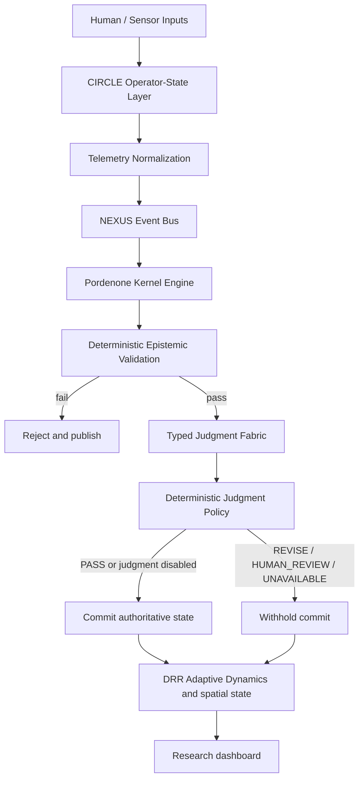

# Architecture Overview: Pordenone

Pordenone is research software: a deterministic validation kernel, simulated telemetry, and a 3D dashboard. The repositories named in the [integration matrix](integration-matrix.md) are a conceptual map. Their ideas are reimplemented in this repository. Nothing here commands physical hardware.

## Conceptual Pipeline

## Core Components

1. **Kernel Engine (`crates/kernel-core`)**
   - Implements `Observe -> Propose -> Validate -> Judge -> Policy -> Commit or withhold -> Publish`.
   - Ensures no agent proposal mutates authoritative state until epistemic validation succeeds.
   - Calls typed judgment only after deterministic validation passes, then applies `JudgmentPolicy` before commit.
   - Manages adaptive policy level adjustments (`NORMAL`, `ELEVATED`, `HIGH`, `CRITICAL`).

2. **Epistemic Validator (`crates/epistemic-validator`)**
   - Evaluates proposals for coordinate feasibility, non-contradiction, state consistency, and provenance.
   - Returns structured `ValidationResult` explaining accepted vs rejected proposals.
   - Remains the deterministic gate. Typed judgment does not replace it.

3. **Typed Judgment (`crates/typed-judgment`)**
   - Provider-neutral `JudgmentProvider` with disabled, deterministic mock, TypeSafe, and recorded-replay implementations.
   - See [`typed-judgment.md`](typed-judgment.md).

4. **Event Bus (`crates/event-bus`)**
   - Asynchronous in-memory event bus providing fan-out broadcast, correlation tracking, and structured tracing.

5. **Simulated human-state telemetry (`services/biometric-pipeline`)**
   - Local stand-in for the human-state ideas associated with `circle`.
   - Labels samples `SIMULATED` unless the process is started in `LIVE` mode.

6. **Simulation engine (`services/sim-engine`)**
   - Local swarm step (`SwarmEmergenceSimulator`) and adaptive-state calculator (`DynamicResonanceRootingAdapter`).

7. **Spatial state (`crates/spatial-state`)**
   - In-repository spatial index (`SpatialIndex`).

8. **Research dashboard (`apps/c2-dashboard`)**
   - Next.js application with a React Three Fiber spatial canvas, human-state panel, agent list, event feed, and validation inspector.
   - The directory name is historical. The view does not issue commands to physical systems.
