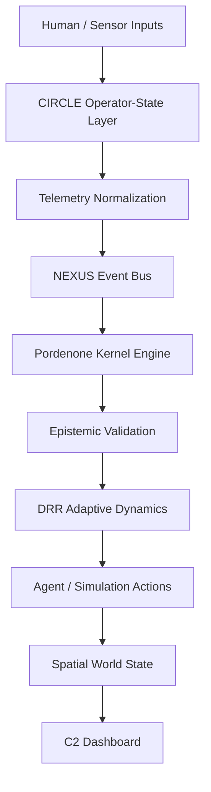

# Architecture Overview: Pordenone

Pordenone is a unified cognitive cyber-physical command-and-control (C2) research platform integrating 8 domain-specific repositories behind clean, versioned interfaces.

## Conceptual Pipeline

## Core Components

1. **Kernel Engine (`crates/kernel-core`)**
   - Implements the state-machine loop: `Observe -> Propose -> Validate -> Commit -> Publish`.
   - Ensures no agent proposal mutates authoritative state until epistemic validation succeeds.
   - Manages adaptive policy level adjustments (`NORMAL`, `ELEVATED`, `HIGH`, `CRITICAL`).

2. **Epistemic Validator (`crates/epistemic-validator`)**
   - Evaluates proposals for coordinate feasibility, non-contradiction, state consistency, and provenance.
   - Returns structured `ValidationResult` explaining accepted vs rejected proposals.

3. **Event Bus (`crates/event-bus`)**
   - Asynchronous in-memory event bus providing fan-out broadcast, correlation tracking, and structured tracing.

4. **Biometric Telemetry Pipeline (`services/biometric-pipeline`)**
   - Adapts CIRCLE physiological models.
   - Labels all data as `SIMULATED` vs `LIVE`.

5. **Simulation Engine (`services/sim-engine`)**
   - Adapts `ions-x-deep-emergence-lab` swarm dynamics and `dynamic-resonance-rooting` (DRR) adaptive state calculations.

6. **Spatial State (`crates/spatial-state`)**
   - Canonical 3D spatial index adapted from `lop-nur-twin` and `cognisync-terrain-weaver`.

7. **C2 Dashboard (`apps/c2-dashboard`)**
   - Next.js application with React Three Fiber 3D spatial canvas, real-time operator panel, agent panel, event feed, and validation inspector.
